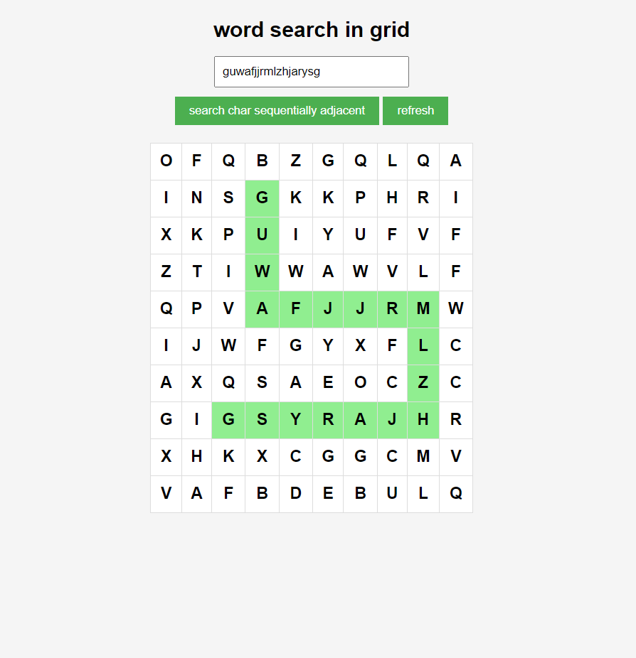

# word search task

With a given 2D letters matrix & a Given  sequence of characters
find if exists a sequentially adjacent (horizontal and vertical only ) cells contains the sequence the same letter cell may not be used more than once 

